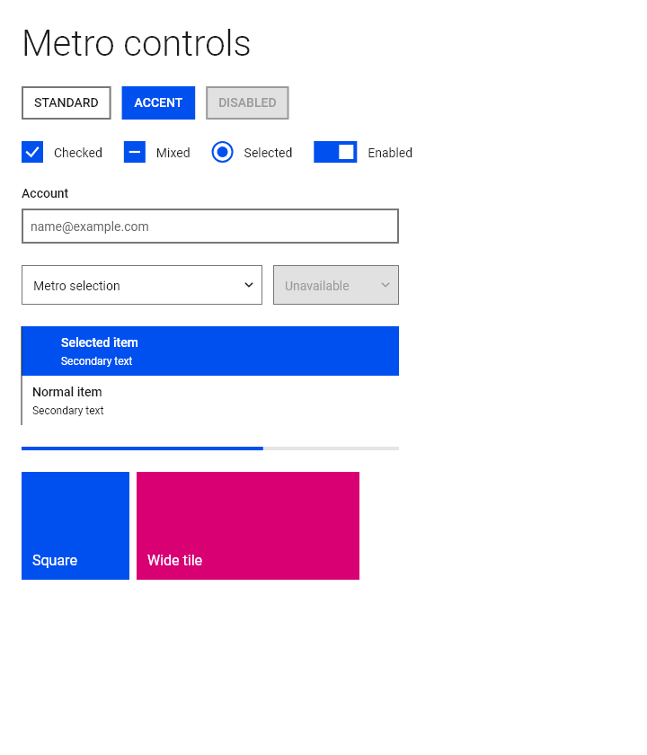
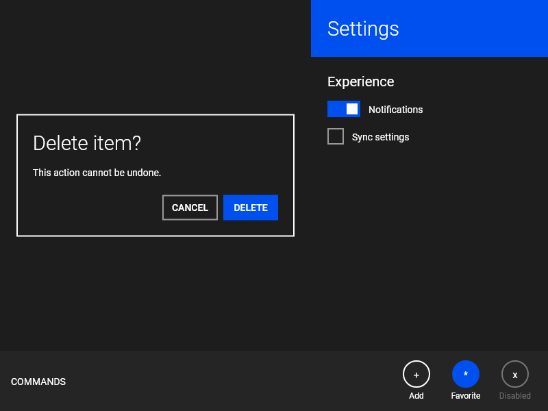

# metro_ui

`metro_ui` is a Flutter component library for building interfaces inspired by
Windows 8 and Windows 8.1 Modern UI (formerly Metro).

It favors typography-led layouts, flat surfaces, square geometry, one strong
accent color, direct manipulation, and purposeful motion. It intentionally
does not reproduce later Fluent styling such as acrylic, Mica, reveal effects,
or rounded card surfaces.

> This package is in early development. Public APIs may change before 1.0.0.

`metro_ui` is an independent open-source project. It is not affiliated with or
endorsed by Microsoft.

## Preview





## Install

Add the package to your application:

```sh
flutter pub add metro_ui
```

Then import its single public entry point:

```dart
import 'package:metro_ui/metro_ui.dart';
```

## Build a first page

Wrap the application or page subtree in `MetroTheme`, then compose Metro
widgets as usual. Flutter's `MaterialApp` is still useful for navigation,
localization, and platform integration.

```dart
import 'package:flutter/material.dart';
import 'package:metro_ui/metro_ui.dart';

void main() {
  runApp(
    MaterialApp(
      home: MetroTheme(
        data: MetroThemeData.light(accentColor: MetroColors.cobalt),
        child: MetroPage(
          title: const Text('Start'),
          child: MetroTileGrid(
            children: [
              MetroTile(
                icon: const Icon(Icons.mail_outline),
                title: 'Mail',
                onPressed: () {},
              ),
              MetroTile(
                size: MetroTileSize.wide,
                backgroundColor: MetroColors.magenta,
                title: 'Photos',
                onPressed: () {},
              ),
            ],
          ),
        ),
      ),
    ),
  );
}
```

Run the included Gallery on Windows or the web:

```sh
cd example
flutter run -d windows
# or
flutter run -d chrome
```

## What is included

- themes, colors, typography, spacing, motion, localization, and accessibility
  support;
- buttons, tiles, live tiles, lists, selection controls, text and numeric
  inputs, combo boxes, search boxes, sliders, and data grids;
- pages, pivots, command bars, flip views, semantic zoom, focus traversal, and
  Windows 8-inspired page transitions;
- dialogs, flyouts, tooltips, date and time pickers, and progress indicators.

Every interactive control is designed for touch, mouse, keyboard, focus,
semantics, RTL layouts, and reduced-motion preferences. See the generated API
documentation for the full public surface.

## Use the theme

The light, dark, and high-contrast factories provide a coherent starting point.
Set an accent color once, then customize individual component themes only where
needed.

```dart
final theme = MetroThemeData.dark(
  accentColor: MetroColors.teal,
).copyWith(
  tileTheme: const MetroTileThemeData(extent: 152, spacing: 8),
);

AnimatedMetroTheme(
  data: theme,
  highContrastData: MetroThemeData.highContrastDark(),
  child: const MyPage(),
)
```

For a local override, place the matching component theme around a subtree.
Widget values take precedence over local component themes, which take
precedence over `MetroThemeData`.

```dart
MetroTextFieldTheme(
  data: const MetroTextFieldThemeData(
    style: MetroTextFieldStyle(
      borderColor: WidgetStatePropertyAll(MetroColors.teal),
    ),
  ),
  child: const MetroTextField(placeholder: 'Locally themed'),
)
```

## Localization and fonts

`MetroLocalizations` supplies English and Simplified Chinese strings. Register
its delegate alongside Flutter's standard delegates when your application uses
localization:

```dart
MaterialApp(
  localizationsDelegates: const [
    GlobalMaterialLocalizations.delegate,
    GlobalWidgetsLocalizations.delegate,
    GlobalCupertinoLocalizations.delegate,
    MetroLocalizations.delegate,
  ],
  supportedLocales: MetroLocalizations.supportedLocales,
  home: const MyApp(),
)
```

The package uses Windows' installed Segoe UI when available. Elsewhere it uses
the bundled, OFL-licensed Selawik fallback. Applications that need broader
script coverage can provide a licensed font through `MetroTypography`.

## Documentation

- [Design language and references](doc/design.md)
- [Development and contribution guide](CONTRIBUTING.md)
- [Architecture and maintenance notes](doc/development.md)
- [Release checklist](doc/releasing.md)
- [Changelog](CHANGELOG.md)

## License

MIT. See [LICENSE](LICENSE).
